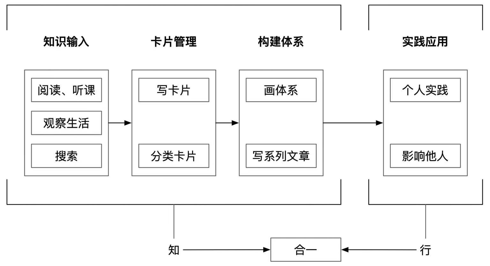

## 【卡片讲解】

知行合一体系是一套指导实践知行合一的方法论。

知行合一包含四个模块：

- 知识输入：包括输入源筛选和识别，搜索方法，卡片法整理等
- 卡片管理：对卡片进行主题整理，主题可以可分为多级
- 构建体系：利用分类的卡片构建针对某个主题的知识体系
- 实践应用：个人实践和影响他人

## 【原文与出处】

四大模块不一定非要按顺序进行，可以根据情况，多个模块合并开展，相互影响。

———— 《学习学习：快速变强四步法》