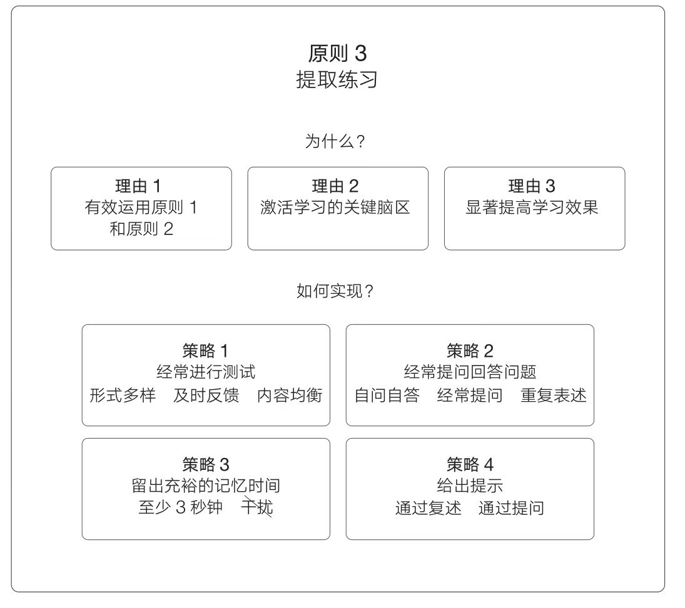

## 【卡片讲解】

下面的方法是站在一个教学者的角度提出的，不过对于自学也很有启发。而且，教会别人也是一个很好的学习策略，在教别人的时候可以用上下面的方法。

- 经常进行测试，但不是为了打分或者评判，而是进行提取练习。对于自学者，可以在学习时给自己出一套题目，用于在将来进行自我测试。
- 经常提问和回答问题。在学习过程中针对已经学习过或者阅读过的内容提问，然后回答。比如，资料的重点内容是什么，材料是怎么组织的，复述刚刚读过的内容等等。
- 留出充裕的记忆提取时间，不要中断信息提取过程。这是站在教授者的角度提出的策略，自学者可以在提取的过程中克制自己看答案的冲动，尽可能提取更多东西。
- 给出提示。当复述不成功，可以在细微处给出提示，逐渐明确。自学者可以在看答案前，给自己设置几个提示词，如果还不行就看答案吧。

## 【原文与出处】

提取练习可以促进学习，因为它不仅激活了与学习相关的神经元，从而巩固了神经连接，还激活了学习的关键脑区，能够显著提高学习效果。要进行提取练习，我们可以经常进行测试，经常回答问题，留出充裕的记忆提取时间，并在必要时给出提示。