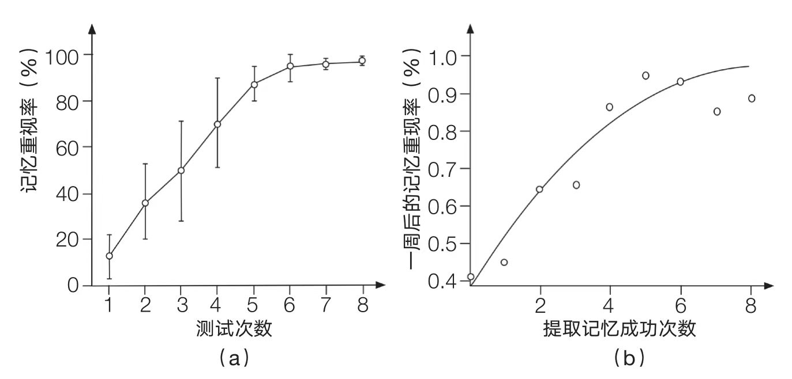

## 【卡片讲解】

每个人的“聪明”成度不同，学习的效果也自然存在差异。

刚开始做提取练习时，个体之间的差异会比较大，资质好的明显优于资质差的人，但随着提取次数的增加，两者之间的差异会逐渐减小。

虽然聪明人前期可以在相同的努力下获得更好的效果，但是学习的大门并没有对“愚笨”的人关上，他们可以通过努力达到和聪明人一样的高度。

勤能补拙！当然，一定是在用对方法的前提下。

## 【原文与出处】

a图显示记忆重现率随着测试或提取练习周期的数量而变化
b图显示一周后记忆重现的概率随着成功提取记忆的次数增加而增加

a图呈现的另一个趋势也值得强调，那就是个体之间的差异会随着训练次数的增加而减小。事实上，在图中的每个点上的竖线顶端和底部之间的长度表示个个体与个体之间记忆重现率的差异。竖线越长，个体之间的记忆重现率差异越大。一般来说，竖线的长度会随着测试次数的增加而减少。